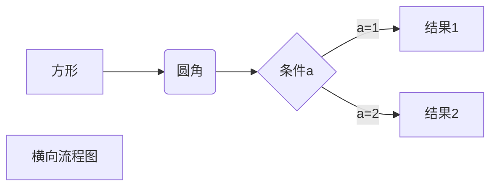

标记标题
---

*一个星号或下划线是斜体*，
**两个星号或下划线是加粗**，
***两个星号或下划线是斜体加粗***，
~~两个波浪线是删除~~
<u>下划线用html的标签</u>

[^中括号]
[^中括号]:中括号起始符号是脚注

[中括号加小括号是](www.baidu.com)

|竖线 | 表头|居中对齐|
|:-------|-------:|:-----:|
|冒号加左边左对齐|冒号加右边右对齐|两边加冒号居中对齐|

***
---
* * *
- - - 
------

